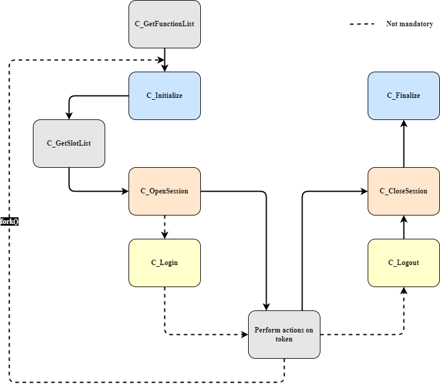

# Cryptoki Session Flow

A typical Cryptoki session follows these steps:

1. `C_GetFunctionList` - Retrieve function pointers.
2. `C_Initialize` - Initialize the Cryptoki library.
3. `C_GetSlotList` - Obtain available token slots.
4. `C_OpenSession` - Open a session with a token.
5. `C_Login` (if necessary) - Authenticate user if required.
6. Perform actions on the token.
7. `C_Logout` (if necessary) - Log out from the token.
8. `C_CloseSession` - Close the session.
9. `C_Finalize` - Clean up Cryptoki resources.

## Applications and Processes

On most platforms, a Cryptoki application runs as a single process. In UNIX environments, a process (P) using Cryptoki can create a child process (C) using `fork()`. Since P and C have separate address spaces (or will upon a write operation if using copy-on-write), they are considered separate applications.

If C needs to use Cryptoki, it must:

- Perform its own `C_Initialize` call.
- Log into tokens independently from P if required.

If C tries to use Cryptoki without its own `C_Initialize` call, the behavior is undefined. Ideally, it would return `CKR_CRYPTOKI_NOT_INITIALIZED`, but due to performance considerations, this is not enforced.

### Best Practices

- If C is created from a Cryptoki application, it should call `C_Initialize` immediately.
- If C does not need Cryptoki, it should call `C_Finalize` right after initialization.
- Following these practices prevents dangling duplicate resources created during the `fork()` call.

  

<b> Session flow </b>
  

---
**© RSA Security Inc. — Public-Key Cryptography Standards (PKCS#11) v220**  
